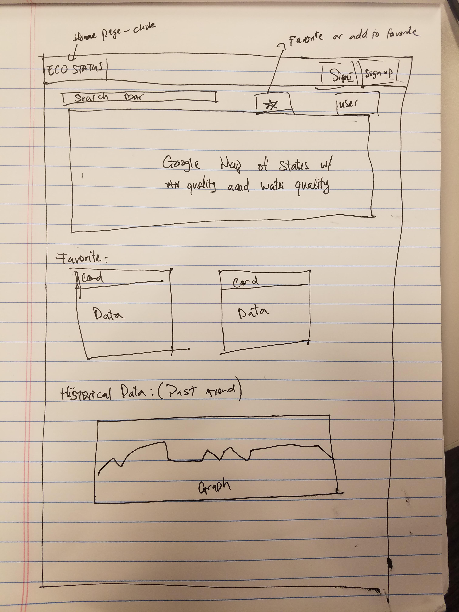

# EcoStatus
### Vu Le, Jason Jia, Federico Paredes

## Description

 The air quality and water quality of the users location of choice will be compiled to be able to see how their health may be effected. This data will be persistent and over time will be comparable to see trends of their location. Graphs and visualisation of the data will be included.

 - - -

## Sketch

- - -

## APIs To Be Used

* Airvisual

* USGS Water Services

* Google Maps

- - -

## Breakdown of Tasks

1) Wireframe of HTML.

2) AJAX call for Airvisual, work with JSON to display properly

3) AJAX call for USGS Water Services, work with JSON to display properly

4) AJAX call for Google Maps, compile data from air and water to display around users location of choice

5) Store user login to firebase for persistence

6) Favorite locations for user stored in firebase

7) Extra: Have an option to display historical data of eco quality

8) Extra: Buttons for local beach water and air quality stats

- - - 

## Roles

Vu: Back end

Jason: Back end

Federico: Front end

